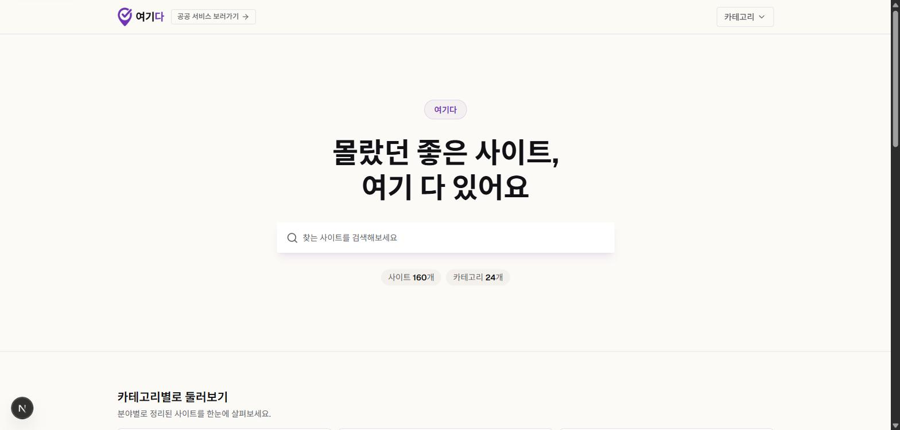
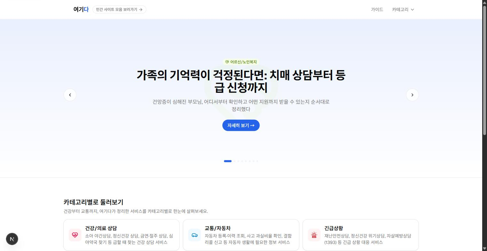
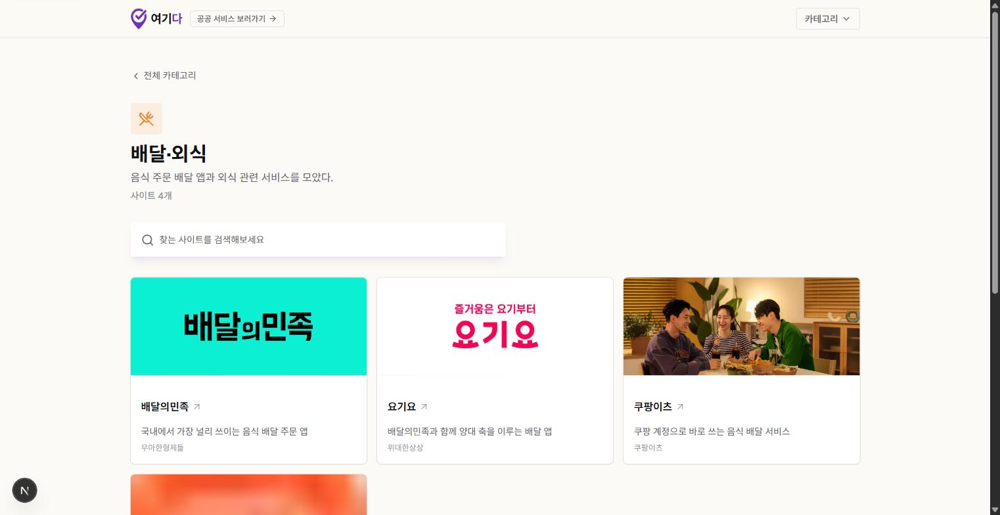
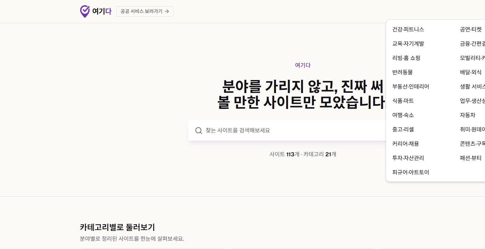
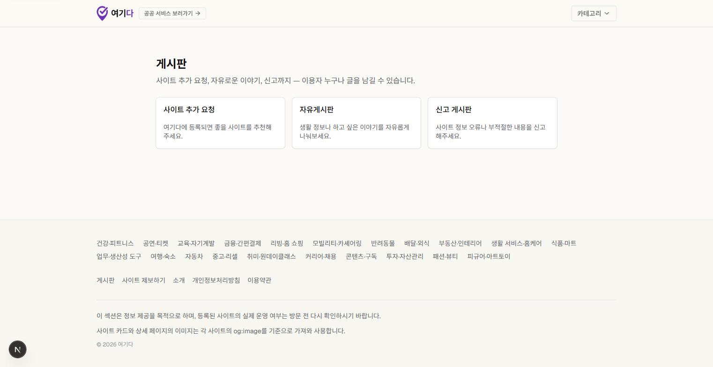

# 여기다에 "발견" 섹션을 만든 이야기

안녕하세요, 생활 밀착형 서비스 큐레이션 사이트 "여기다"를 만들고 있습니다. 여기다는 혼자 운영하는 사이드 프로젝트라, 실제 코드를 짜는 작업은 앤트로픽의 AI 코딩 도구인 클로드(Claude Code)와 함께하고 있습니다. 오늘은 공공기관 서비스만 다루던 여기다에 민간·일반 사이트를 모아 소개하는 새로운 섹션, `/discover`를 만든 이야기를 나눠보려고 합니다. 참고로 지금 읽고 계신 이 글도, 그동안 나눈 대화와 커밋 기록을 클로드와 함께 정리하며 쓴 글입니다.

---

## 왜 만들었을까요

여기다는 원래 정부·공공기관이 운영하는 서비스만 다루는 곳이었습니다. 등록된 서비스 127개가 전부 보건복지부, 경찰청, 국토교통부 같은 공공기관 소관 서비스였고, "링크모음이 아니라 공익적 큐레이션"이라는 게 여기다가 지켜온 신뢰의 기준이었습니다.

그런데 여기다를 운영하면서 저 스스로도 궁금한 게 생겼습니다. 공공서비스 말고도 세상엔 분야별로 정말 다양한 민간 사이트들이 있는데, 저조차도 그걸 다 알지는 못한다는 걸요. 저 자신이 여러 분야의 쓸 만한 사이트들을 한눈에 알고 싶었고, 그런 민간 사이트들을 여기다에도 하나씩 추가해보고 싶다는 마음이 들었습니다. 다만 걱정도 있었습니다. 공익적 큐레이션이라는 정체성이 뚜렷한 사이트에 민간 서비스를 그대로 섞으면, 애써 쌓아온 신뢰가 흔들릴 수도 있으니까요.

이 고민을 클로드와 나누면서 결론을 내렸습니다. 아예 다른 디자인을 가진 **완전히 독립된 섹션**을 새로 만들자는 것이었습니다. 클로드는 처음에 기존 서비스 데이터에 `sourceType: public/private` 같은 구분값 하나만 추가해서 뱃지나 필터로 나누는 방법을 제안했습니다. 브랜드를 하나로 유지할 수 있고 관리 부담도 적다는 이유였습니다. 하지만 성격이 다른 두 콘텐츠를 한 지붕 아래 억지로 묶기보다는, 처음부터 깔끔하게 분리하는 편이 맞겠다고 판단해서 저는 별도 섹션 쪽으로 방향을 정했습니다.

그렇게 해서 `/discover`라는 새 주소 아래, 기존과는 색감도 느낌도 다른 독립 섹션이 태어났습니다. 지금은 카테고리 24개, 실제 사이트 160개가 등록되어 있고 배달의민족, 당근, 쿠팡, 에어비앤비, 뱅크샐러드처럼 다들 한 번쯤 써봤을 익숙한 서비스들을 만나보실 수 있습니다. 첫 화면 문구도 사이트 이름 "여기다"에서 착안해 "몰랐던 좋은 사이트, 여기 다 있어요"라는 말장난으로 정했습니다. 짧고 쉽게 기억에 남으면서도 이름이 곧 카피가 되니까요.

*완성된 `/discover` 홈 화면입니다. 상단 로고 옆의 "공공 서비스 보러가기"는 나중에 새로 붙인 상호 링크입니다.*

---

## 뼈대부터 세우고, 콘텐츠는 천천히 채워나갔습니다

새로운 섹션을 만들 때 욕심을 부리지 않으려고 했습니다. 카테고리와 사이트 데이터를 담을 파일(`data/sites.json`, `data/site-categories.json`)을 일단 빈 배열로 시작해서, 틀만 먼저 완성하고 실제 콘텐츠는 관리자 화면에서 천천히 채워나가기로 했습니다.

이렇게 나누니 지금 해야 할 일이 훨씬 또렷해졌습니다. 스키마를 짜고, 라우팅을 만들고, 디자인 인프라를 갖추는 일에만 집중할 수 있었고, 실제로 어떤 사이트를 소개할지 고르고 검증하는 일은 전혀 다른 리듬의 작업이라 별도로 진행할 수 있었습니다. 처음엔 기존 사이트와 `/discover` 사이에 아무런 연결 고리도 두지 않기로 했습니다. 신뢰의 결이 다른 두 콘텐츠를 처음부터 섞고 싶지 않았기 때문입니다.

데이터 스키마를 어떻게 짤지, 라우팅은 어떤 폴더 구조로 나눌지 같은 구체적인 설계도 클로드와 하나씩 상의하면서 잡아나갔습니다. 큰 그림은 제가 정하고, 그걸 실제 코드 구조로 옮기는 작업은 클로드에게 맡기는 식으로 손발을 맞췄습니다.

---

## 실제로 콘텐츠를 채워보니 생각이 달라진 것도 있었습니다

뼈대가 다 세워지고 실제로 카테고리 21개, 사이트 113개를 채워 넣고 나니, 처음에 세운 원칙 중 하나를 다시 들여다보게 됐습니다. 바로 "두 섹션 사이에 링크를 걸지 않는다"는 결정이었습니다.

막상 콘텐츠가 쌓이고 보니, 두 사이트가 서로의 존재를 전혀 모르는 것처럼 완전히 남남으로 지내는 게 오히려 부자연스럽게 느껴졌습니다. 그래서 로고 옆에 작은 버튼을 하나씩 달았습니다. 메인 헤더에는 "민간 사이트 모음 보러가기"를, 발견 헤더에는 "공공 서비스 보러가기"를요. 디자인도, 데이터도, 주소 체계도 그대로 분리해서 유지하되, 서로를 오갈 수 있는 문 하나만 살짝 열어둔 셈입니다. 따로 지내지만 서로 존재는 알 수 있게, 딱 그 정도의 절충이었습니다.

*메인 헤더에는 "민간 사이트 모음 보러가기", 발견 헤더에는 "공공 서비스 보러가기" 버튼이 각각 자리 잡았습니다.*

처음 세운 원칙이 늘 끝까지 맞는 건 아니었습니다. 콘텐츠가 채워지고 나서야 비로소 보이는 문제도 있다는 걸 이번에 다시 느꼈습니다.

---

## 사이트 113개, 어떻게 등록했을까요

사이트 113개를 하나하나 관리자 화면에서 썸네일 이미지를 내려받아 올리는 건 아무래도 무리한 일이었습니다. 그래서 각 사이트의 대표 이미지를 자동으로 가져와주는 작은 스크립트(`scripts/fetch-discover-thumbnails.mjs`)를 클로드와 함께 만들었습니다. 이런 반복적인 자동화 스크립트는 특히 클로드에게 맡기기 좋은 작업이라, 우선순위 로직만 제가 정해주고 나머지 구현은 대부분 맡겼습니다.

각 사이트 홈페이지에 접속해서 `og:image`부터 시작해 `og:image:secure_url`, `twitter:image`, `apple-touch-icon`, `icon`, 그리고 마지막으로 구글 파비콘 서비스까지 순서대로 시도하면서 가장 적당한 이미지를 찾아 저장하도록 했습니다. 이미 썸네일이 채워진 사이트는 건너뛰도록 만들어서, 몇 번을 다시 실행해도 안전합니다.

*배달의민족, 요기요, 쿠팡이츠 카드에 보이는 이미지는 사람이 하나하나 캡처한 게 아니라, 각 사이트의 og:image 태그에서 스크립트가 자동으로 가져온 것입니다.*

콘텐츠 큐레이션 사이트를 운영하다 보면 이런 반복 작업이 생각보다 자주 생깁니다. 사람이 붙잡고 있어야 할 것 같은 일도, 우선순위를 잘 정해두면 스크립트 하나로 훨씬 가볍게 풀 수 있다는 걸 다시 확인한 시간이었습니다.

---

## 카테고리가 늘어나니 메뉴가 좁아졌습니다

카테고리가 몇 개 안 될 때는 가로로 스크롤되는 알약 모양 메뉴만으로도 충분했습니다. 그런데 21개까지 늘어나고 나니 헤더가 두 줄로 밀리거나, 스크롤이 너무 길어지는 문제가 생겼습니다.

그래서 데스크톱에서는 카테고리를 누르면 2열로 펼쳐지는 드롭다운 메뉴로, 모바일에서는 햄버거 버튼을 누르면 열리는 시트 메뉴로 바꿔서 헤더를 다시 한 줄로 정리했습니다.

*데스크톱에서는 드롭다운으로, 모바일에서는 햄버거 시트로 21개 카테고리를 담아냈습니다.*

UI의 진짜 한계는 콘텐츠가 어느 정도 쌓여야 비로소 눈에 보이는 것 같습니다. 다행히 쓰고 있는 컴포넌트 라이브러리(shadcn/ui)에 드롭다운과 시트 컴포넌트가 이미 준비되어 있어서, 코드를 새로 짜지 않고도 반나절 만에 대응할 수 있었습니다.

---

## 겉모습은 다르지만 속은 같은 컴포넌트를 쓰고 있습니다

`/discover` 섹션은 카드, 뱃지, 버튼 같은 컴포넌트를 기존 사이트와 코드 한 줄도 다르지 않게 그대로 재사용하고 있습니다. 그런데도 화면을 보면 메인 사이트는 파란 계열에 둥근 카드, 발견 섹션은 보라 계열에 각진 카드로 완전히 다른 느낌을 줍니다.

비결은 색상이나 모서리 둥글기 같은 값을 컴포넌트에 직접 박아두지 않고, 변수 형태로 간접 참조하도록 만들어둔 데 있습니다. 그래서 발견 섹션을 감싸는 영역 안에서만 그 변수들의 값을 다시 정의해주면, 같은 컴포넌트가 전혀 다른 배색과 모서리 반경으로 그려지는 것입니다. 디자인 시스템을 이렇게 변수 중심으로 만들어두면, 브랜드 하나를 통째로 바꾸는 일도 CSS 몇 줄로 끝낼 수 있다는 걸 실감했습니다.

---

## 라우팅 구조 하나로 완전히 다른 사이트 두 개를 운영합니다

기존 URL은 하나도 건드리지 않으면서 두 섹션을 완전히 분리하기 위해, Next.js의 "라우트 그룹"이라는 기능을 활용했습니다. 폴더 이름을 괄호로 감싸두면 그 이름이 실제 주소에는 나타나지 않는 방식인데, 덕분에 `/`, `/category/...`, `/service/...` 같은 기존 주소는 그대로 두면서도 두 섹션이 서로 다른 헤더, 푸터, 메타데이터, 색상 테마를 가질 수 있었습니다.

가장 바깥의 레이아웃은 폰트, 태그 매니저, 애널리틱스, 광고 스크립트처럼 두 섹션이 공통으로 필요로 하는 것만 담당하는 아주 얇은 껍데기로 남겨두고, 실제 헤더와 푸터는 각 섹션의 레이아웃이 따로 그리도록 정리했습니다. 하나의 저장소, 하나의 배포 과정 안에서 완전히 다른 분위기의 사이트 두 개를 함께 운영할 수 있게 된 셈입니다.

---

## 페이지 제목 때문에 조금 헤맸습니다

작업하다가 재미있는 버그를 하나 만났습니다. 발견 섹션 레이아웃에 페이지 제목 규칙을 정의해뒀는데, 정작 발견 홈 화면의 탭 제목이 이상하게 두 번 겹쳐서 나오는 문제였습니다.

클로드와 함께 원인을 찾아 들어갔더니 이유가 있었습니다. 레이아웃에 정해둔 기본 제목은, 정작 자기 자신의 규칙이 아니라 가장 가까운 상위 레이아웃의 규칙에 의해 한 번 더 감싸진다는 것이었습니다. 그래서 발견 레이아웃에 정해둔 기본 제목이, 가장 바깥 레이아웃의 규칙에 의해 또 한 번 감싸이면서 겹친 표기가 만들어지고 있었던 것입니다. 해당 페이지에 "이 제목은 절대적인 값이니 상위 규칙을 적용하지 말아 달라"는 옵션을 명시해주고 나서야 말끔히 해결됐습니다. 직관과는 조금 다르게 동작하는 부분이라, 비슷한 구조로 사이트를 나누는 분들께 참고가 되면 좋겠습니다.

덧붙이자면 이 버그를 계기로 발견 섹션의 이름 자체도 정리했습니다. 여기저기 흩어져 있던 "여기다 발견"이라는 표기를 전부 "여기다"로 통일해서, 지금은 이런 충돌이 애초에 생기지 않는 구조가 되었습니다.

---

## 폴더를 옮기려다 잠깐 막히기도 했습니다

라우트 그룹으로 폴더 구조를 다시 정리하려고 클로드가 관리자 폴더를 옮기는 명령을 실행했는데, 권한이 없다는 오류가 떴습니다. 알고 보니 개발 서버가 그 폴더의 파일을 붙잡고 있었던 것이었습니다. 개발 서버를 잠깐 꺼두고 나서야 폴더를 옮길 수 있었습니다. 클로드와 함께 작업하다 보면 이렇게 사람이 직접 터미널을 만질 때는 잘 안 겪는 사소한 문제도 종종 마주치는데, 대규모로 폴더 구조를 재편할 때는 개발 서버부터 꺼두는 게 마음 편하다는 걸 배운 순간이었습니다.

---

## 궁금한 점을 남기거나 사이트를 제보할 수 있는 공간도 만들었습니다

콘텐츠가 늘어나는 만큼 "링크모음처럼 보이지 않기" 위한 최소한의 장치도 함께 갖췄습니다.

먼저 게시판을 만들었습니다. 사이트 추가 요청, 자유게시판, 신고 게시판 이렇게 세 가지를 이용하실 수 있고, 똑같은 구성이 메인 사이트에도 그대로 마련되어 있습니다. 흥미로운 점은 테이블을 여러 개로 늘리는 대신, 게시글 하나를 담는 테이블 하나에 "어느 사이트의 글인지", "어떤 종류의 글인지"를 나타내는 값 두 개만 추가해서 여섯 가지 조합을 전부 소화하도록 만들었다는 점입니다. 작성자가 직접 글을 고치거나 지우는 기능은 두지 않았고, 관리자만 지울 수 있게 했습니다. 별도의 로그인 없이 누구나 글을 남길 수 있는 만큼, 같은 사용자가 한 시간에 세 번 넘게 글을 남기지 못하도록 하는 최소한의 안전장치도 걸어두었습니다.

그리고 소개 페이지, 사이트를 제보할 수 있는 페이지, 개인정보처리방침, 이용약관도 새로 만들어 하단에 노출했습니다.

*"이 섹션은 정보 제공 목적이며 실제 운영 여부는 방문 전 확인해 달라"는 안내 문구와 소개, 개인정보처리방침, 이용약관 링크가 최소한의 신뢰 장치 역할을 합니다.*

마지막으로 자잘한 정리도 함께 했습니다. 카테고리가 등록된 순서 그대로 노출되던 것을 한글 가나다순으로 다시 정렬해서, 처음 방문하신 분도 원하는 카테고리를 더 쉽게 찾을 수 있도록 했습니다.

---

## 앞으로 더 다듬어야 할 것들

아직 다듬을 부분이 남아 있습니다. 광고 스크립트가 가장 바깥 껍데기에 자리 잡고 있다 보니 발견 섹션에도 자동으로 노출되는데, 콘텐츠가 어느 정도 쌓인 지금이 이 부분을 다시 살펴볼 좋은 시점인 것 같습니다.

게시판의 스팸 방어도 지금은 같은 사용자가 한 시간에 세 번까지만 글을 남길 수 있다는 규칙 하나뿐입니다. 실제로 이용자가 늘어나면 이 부분도 다시 들여다볼 계획입니다.

사이트 대표 이미지를 자동으로 가져오는 스크립트 역시, 이미지 형식이 맞지 않는 일부 사이트에서는 끝까지 이미지를 찾지 못해 손으로 채워넣어야 했던 경우도 있었습니다. 이런 과정도 나중에 따로 정리해서 나눠보면 좋을 것 같습니다.

---

여기까지 여기다에 발견 섹션을 만든 이야기를 나눠봤습니다. 코드를 짜는 과정부터 지금 이 글을 정리하는 과정까지, 처음부터 끝까지 클로드와 함께한 작업이었습니다. 혼자였다면 훨씬 오래 걸렸을 일들을 옆에서 같이 고민해준 클로드에게 고맙다는 말을 남기고 싶습니다. 읽어주셔서 감사합니다.
